# Exercise 3: Managing Objects in Your S3 Bucket
In this lab, you will learn how to **manage objects** in your S3 bucket by performing various operations such as **copying, moving, and deleting objects**. 

Additionally, you will gain an understanding of **object permissions**, including **Access Control Lists (ACLs)** and Bucket Policies.

##### Task 1. Copying Objects from one Bucket/folder to another:
- Select the **object(s)** you want to copy within your S3 bucket.
- Click on the **"Actions"** dropdown menu and choose **"Copy."**
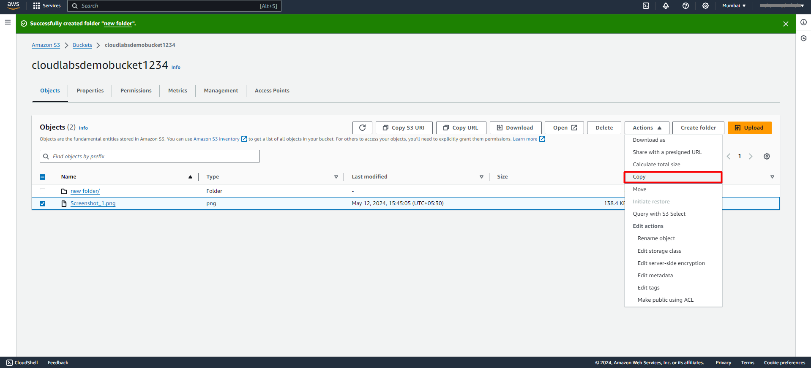 
- Select the **destination bucket** and **folder** (if applicable) for the copied objects. 
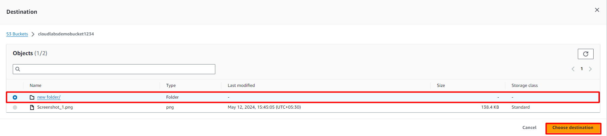 
- Review and confirm the copy operation.
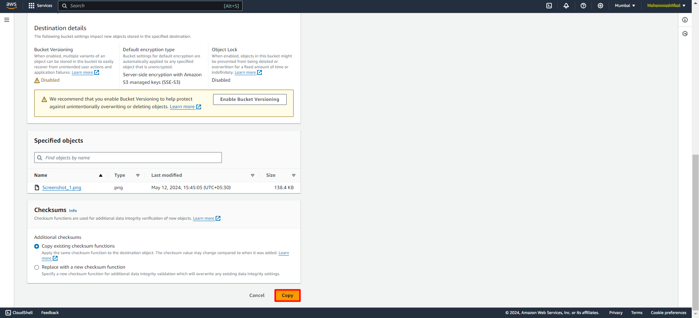 
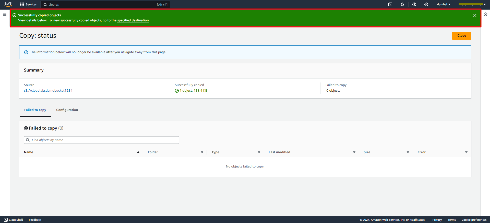 
##### Task 2. Moving Objects from one Bucket/folder to another:
- Select the object(s) you want to move within your S3 bucket.
- Click on the **"Actions"** dropdown menu and choose **"Move."**
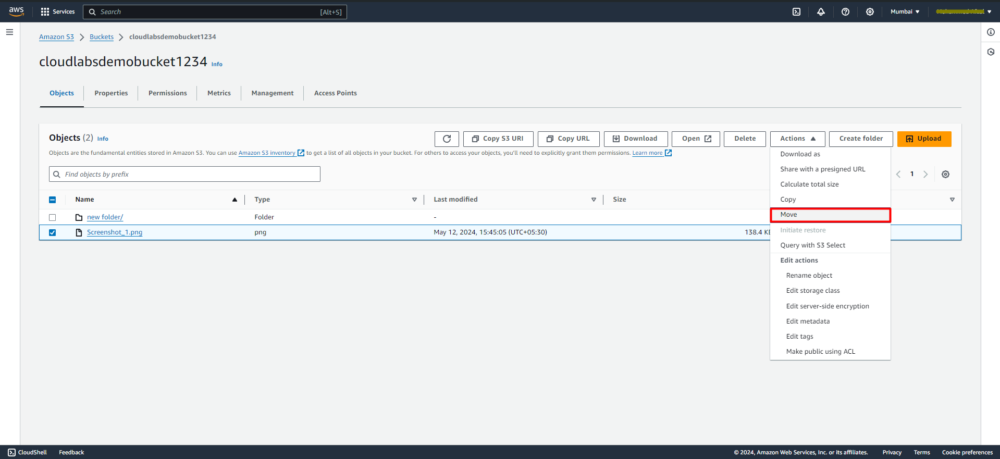 
- Select the **destination bucket** and **folder** (if applicable) for the moved objects.
 
- Review and click on **move** to move operation.
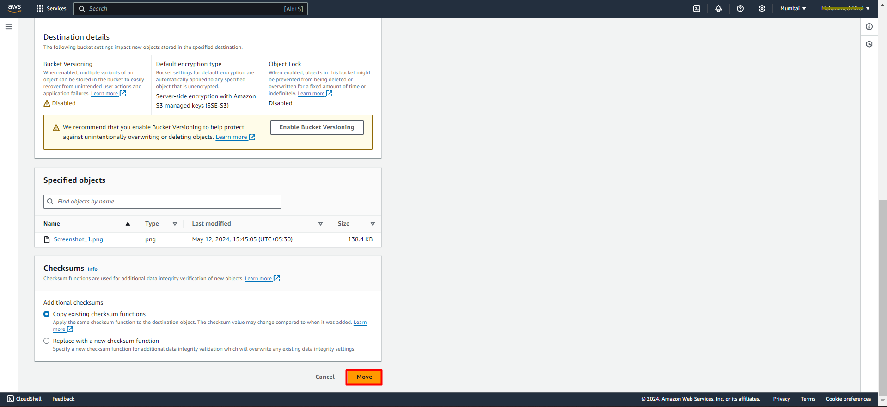 
- Now you have succesfully **moved** an object into the new folder
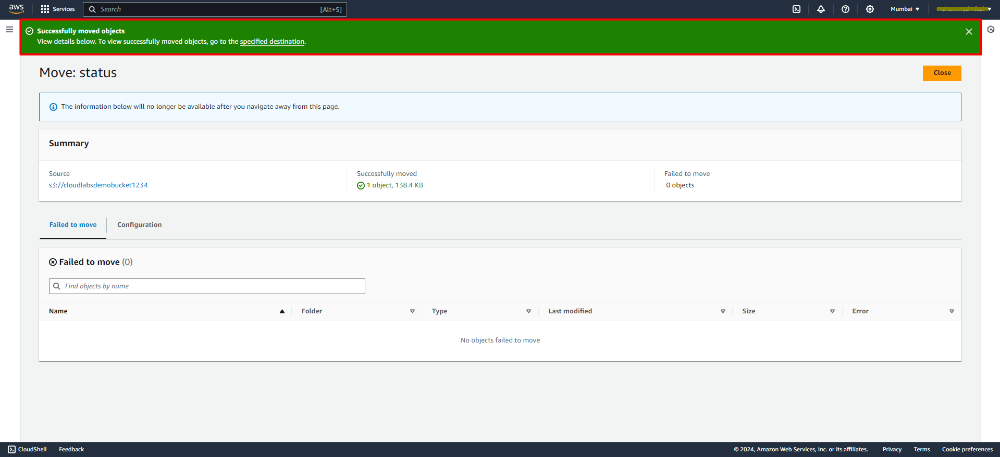 

##### Task 3. Deleting Objects present in Bucket/folder:
- Select the **object(s)** you want to **delete** within your S3 bucket.
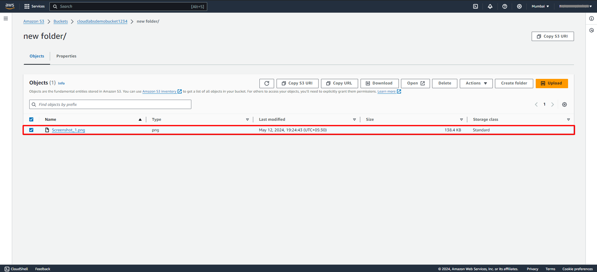 
- Click on **"Delete"** option.
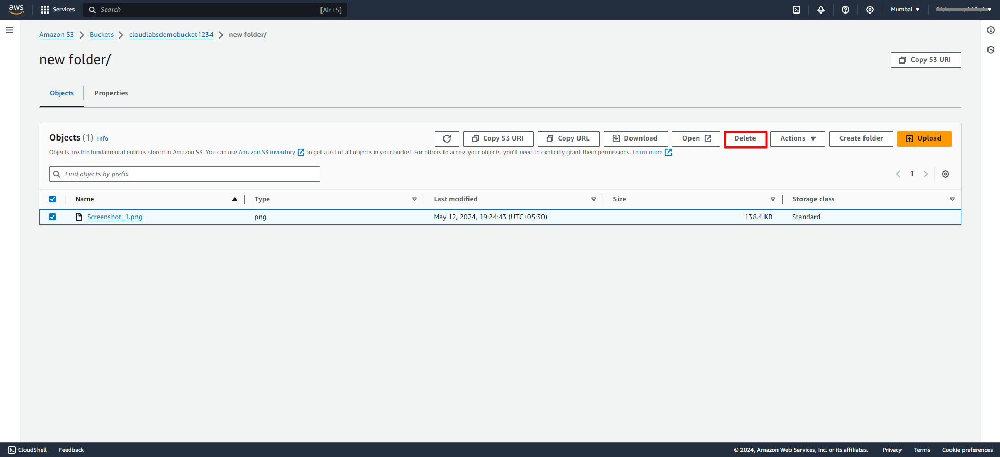 
- To confirm deletion, type **"permanently delete"** in the text input field.
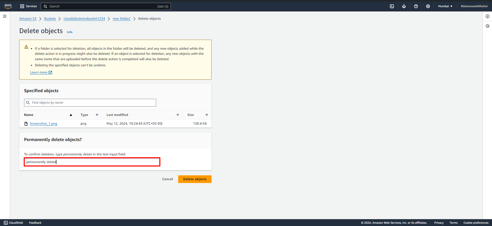 
- Confirm and click on **delete** to move operation.
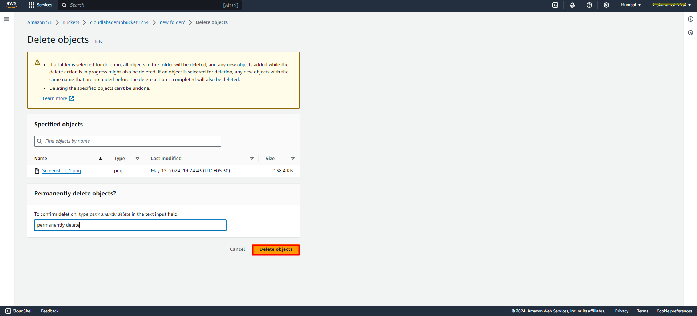
- your object is now successfully deleted from the bucket
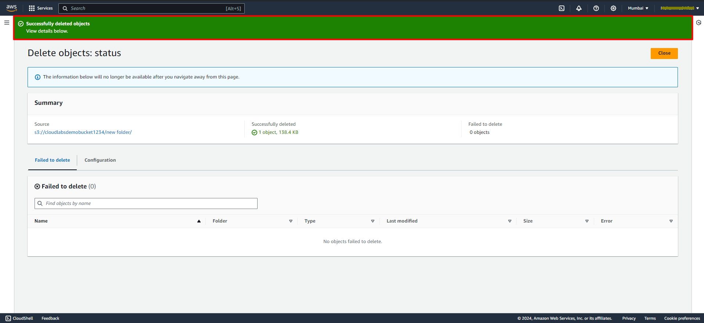

##### Task 4. setting up the Bucket Policiy:

- Bucket Policies are **JSON-based policies** that allow you to **control access** to your S3 bucket at a **bucket level**.
- You can define rules to **grant** or **deny permissions** to specific IP addresses, AWS accounts, or conditions.
- To configure a Bucket Policy, navigate to the **Permissions tab** of your S3 bucket and click on **"Edit"** in Bucket Policy Section.
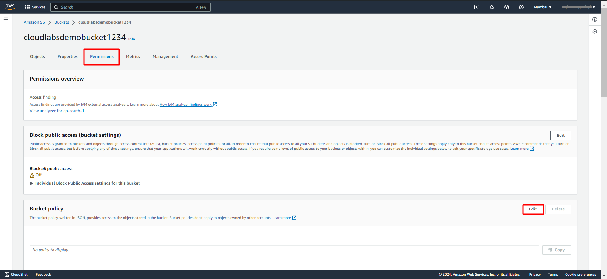
- Write or paste your Bucket Policy in the policy editor and then **save** the changes.
``` {
    "Version": "2012-10-17",
    "Statement": [
        {
            "Sid": "PublicReadGetObject",
            "Effect": "Allow",
            "Principal": "*",
            "Action": "s3:GetObject",
            "Resource": "arn:aws:s3:::your-Bucket-Name/*"
        }
    ]
}
```
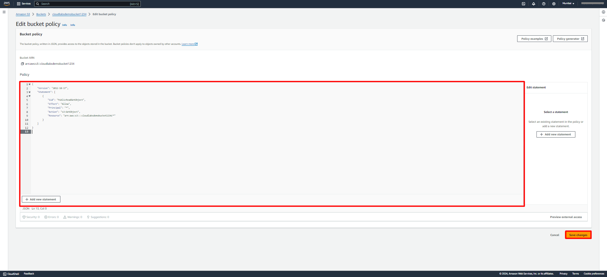
- Successfully aplied the bucket policy.

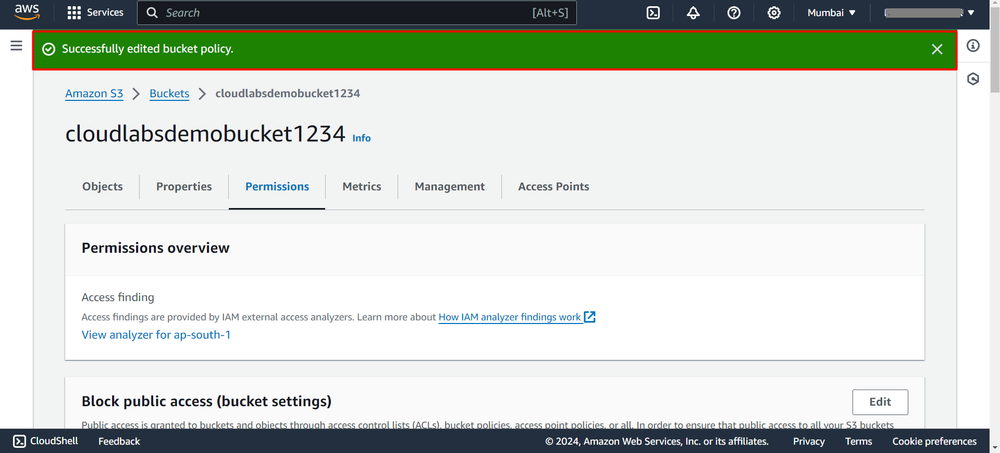